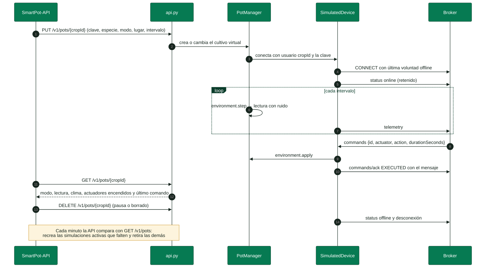

<!-- portada
eyebrow: Documentación del componente
titulo: SmartPot-DataGenerator
acento: DataGenerator
subtitulo: El simulador de SmartPot
bajada: Cultivos virtuales siempre encendidos que hablan el contrato MQTT v1: modelo físico, modos día y noche, manual y clima real, efecto de los actuadores, API de control interna, configuración y pruebas.
documento: SmartPot-DataGenerator
version: 1.1 · octubre 2026
equipo: SmartPotTech
proyecto: smartpot.app
-->

# SmartPot-DataGenerator

## Ficha del documento

| Campo                          | Valor                                                                                                                                                                                                                                                                                                                                                                                                                                                   |
|--------------------------------|---------------------------------------------------------------------------------------------------------------------------------------------------------------------------------------------------------------------------------------------------------------------------------------------------------------------------------------------------------------------------------------------------------------------------------------------------------|
| Proyecto                       | SmartPot · [smartpot.app](https://smartpot.app)                                                                                                                                                                                                                                                                                                                                                                                                         |
| Componente                     | [SmartPot-DataGenerator](https://github.com/SmartPotTech/SmartPot-DataGenerator)                                                                                                                                                                                                                                                                                                                                                                        |
| Versión                        | 1.1 · octubre 2026                                                                                                                                                                                                                                                                                                                                                                                                                                      |
| Alcance                        | Cultivos virtuales, cultivos fijos para demo y QA, modelo físico, API de control, configuración, pruebas y operación                                                                                                                                                                                                                                                                                                                                    |
| Documentación de la plataforma | [Documentación técnica](https://github.com/SmartPotTech/.github/blob/main/docs/SmartPot_Technical_Documentation.md), [recorrido del proyecto](https://github.com/SmartPotTech/.github/blob/main/docs/SmartPot_Project_Journey.md), [ciclo de vida](https://github.com/SmartPotTech/.github/blob/main/docs/SmartPot_Software_Lifecycle.md) y [diagramas generales](https://github.com/SmartPotTech/.github/blob/main/docs/README.md#diagramas-generales) |
| Mantenimiento                  | Se genera desde `docs/` de este repositorio con las herramientas de `.github/docs/tools`; se actualiza con cada cambio del componente                                                                                                                                                                                                                                                                                                                   |

<!-- parte: PARTE I | El componente -->

## 1. Propósito

### En palabras simples

El simulador da vida a los **cultivos virtuales**: los que una persona crea en SmartPot sin hardware. Corre siempre,
junto a la plataforma, y hace lo mismo que un ESP32 con el firmware: publica lecturas por MQTT con la cuenta del
cultivo, obedece las órdenes y las confirma. Solo la API le habla, por la red interna; la persona nunca ve la clave.

| Caso                               | Quién lo pide                                                               | Qué es para la plataforma                                                           |
|------------------------------------|-----------------------------------------------------------------------------|-------------------------------------------------------------------------------------|
| Cultivo virtual                    | La API, al crear un cultivo `VIRTUAL` o al cambiar o reanudar su simulación | Un cultivo virtual: sus lecturas no entran al aprendizaje                           |
| Cultivo fijo (`SIMULATOR_DEVICES`) | La configuración del contenedor (demo y QA)                                 | Un cultivo real que el simulador hace publicar con su clave, como lo haría un ESP32 |

Simular en Wokwi es otra cosa: Wokwi ejecuta el firmware real
de [SmartPot-IoT](https://github.com/SmartPotTech/SmartPot-IoT) en un ESP32 del navegador y cuenta como cultivo real.

## 2. Arquitectura del componente

```mermaid
%%{init: {"theme": "base", "fontFamily": "Segoe UI, Arial, sans-serif", "themeVariables": {"fontFamily": "Segoe UI, Arial, sans-serif", "fontSize": "15px", "primaryColor": "#DDF5EA", "primaryTextColor": "#17261F", "primaryBorderColor": "#067A52", "secondaryColor": "#E3F2FB", "secondaryTextColor": "#17261F", "secondaryBorderColor": "#1F6FA0", "tertiaryColor": "#F2F7F4", "tertiaryTextColor": "#17261F", "tertiaryBorderColor": "#D5E3DC", "lineColor": "#5B6B63", "textColor": "#17261F", "mainBkg": "#DDF5EA", "nodeBorder": "#067A52", "clusterBkg": "#F7FAF8", "clusterBorder": "#D5E3DC", "edgeLabelBackground": "#FFFFFF", "actorBkg": "#067A52", "actorBorder": "#0B3D2B", "actorTextColor": "#FFFFFF", "actorLineColor": "#5B6B63", "signalColor": "#17261F", "signalTextColor": "#17261F", "labelBoxBkgColor": "#0B3D2B", "labelBoxBorderColor": "#0B3D2B", "labelTextColor": "#FFFFFF", "loopTextColor": "#0B3D2B", "noteBkgColor": "#FDF4DD", "noteBorderColor": "#C98D12", "noteTextColor": "#17261F", "activationBkgColor": "#DDF5EA", "activationBorderColor": "#067A52", "attributeBackgroundColorOdd": "#FFFFFF", "attributeBackgroundColorEven": "#F2F7F4"}, "layout": "elk", "elk": {"nodePlacementStrategy": "BRANDES_KOEPF", "mergeEdges": false, "cycleBreakingStrategy": "GREEDY"}}}%%
flowchart LR
  api["SmartPot-API<br/>VirtualDeviceService"]
  meteo["Open-Meteo<br/>clima y geocodificación"]
  broker["SmartPot-Broker<br/>MQTT"]
  subgraph sim["SmartPot-DataGenerator · Python 3.13"]
    direction TB
    main["__main__<br/>arranca los cultivos fijos,<br/>el hilo de publicación y la API"]
    config["config<br/>SIMULATOR_DEVICES · MQTT · token"]
    control["api.py · FastAPI :8081<br/>/v1/pots · /v1/places · /v1/weather<br/>token Bearer"]
    manager["pots.py · PotManager<br/>un VirtualPot por cultivo<br/>altas, cambios y retiros en caliente"]
    env["environment.py<br/>modelo físico · modos AUTO, MANUAL, WEATHER<br/>efecto de los actuadores · ruido"]
    weather["weather.py<br/>clima actual con caché de 10 min<br/>buscador de lugares"]
    device["device.py · SimulatedDevice<br/>cliente MQTT con la cuenta del cultivo<br/>telemetría · comandos · ACK · estado"]
  end
  api -->|"PUT · GET · DELETE /v1/pots<br/>solo red interna"| control
  main --> config & control & manager
  control --> manager
  manager --> env & device
  env --> weather
  weather -->|"HTTPS"| meteo
  device <-->|"smartpot/v1/cropId/*"| broker
  classDef leaf fill:#DDF5EA,stroke:#067A52,color:#17261F
  classDef water fill:#E3F2FB,stroke:#1F6FA0,color:#17261F
  classDef sun fill:#FDF4DD,stroke:#C98D12,color:#17261F
  classDef clay fill:#FBE9E1,stroke:#B85A38,color:#17261F
  classDef core fill:#067A52,stroke:#0B3D2B,color:#FFFFFF
  classDef deep fill:#0B3D2B,stroke:#06281C,color:#FFFFFF
  classDef muted fill:#F2F7F4,stroke:#5B6B63,color:#17261F
  class api,meteo,broker water
  class main,config muted
  class control sun
  class manager core
  class env,weather,device leaf
```

<!-- diagrama: SmartPot_DataGenerator_Global_Component | titulo=SmartPot-DataGenerator por dentro | lamina=H -->

<!-- parte: PARTE II | Funcionamiento -->

## 3. Vida de un cultivo virtual

<!-- diagrama: SmartPot_DataGenerator_01_Virtual_Crop_Lifecycle | titulo=Vida de un cultivo virtual en el simulador -->

La API decide cuándo existe una simulación: la crea con el cultivo, la retira al pausarla o al borrar el cultivo y cada
minuto reconcilia lo que el simulador tiene con lo que dice `virtual_devices`. Así, tras un reinicio del simulador, los
cultivos virtuales activos vuelven en menos de un minuto.

## 4. Modelo físico

```mermaid
%%{init: {"theme": "base", "fontFamily": "Segoe UI, Arial, sans-serif", "themeVariables": {"fontFamily": "Segoe UI, Arial, sans-serif", "fontSize": "15px", "primaryColor": "#DDF5EA", "primaryTextColor": "#17261F", "primaryBorderColor": "#067A52", "secondaryColor": "#E3F2FB", "secondaryTextColor": "#17261F", "secondaryBorderColor": "#1F6FA0", "tertiaryColor": "#F2F7F4", "tertiaryTextColor": "#17261F", "tertiaryBorderColor": "#D5E3DC", "lineColor": "#5B6B63", "textColor": "#17261F", "mainBkg": "#DDF5EA", "nodeBorder": "#067A52", "clusterBkg": "#F7FAF8", "clusterBorder": "#D5E3DC", "edgeLabelBackground": "#FFFFFF", "actorBkg": "#067A52", "actorBorder": "#0B3D2B", "actorTextColor": "#FFFFFF", "actorLineColor": "#5B6B63", "signalColor": "#17261F", "signalTextColor": "#17261F", "labelBoxBkgColor": "#0B3D2B", "labelBoxBorderColor": "#0B3D2B", "labelTextColor": "#FFFFFF", "loopTextColor": "#0B3D2B", "noteBkgColor": "#FDF4DD", "noteBorderColor": "#C98D12", "noteTextColor": "#17261F", "activationBkgColor": "#DDF5EA", "activationBorderColor": "#067A52", "attributeBackgroundColorOdd": "#FFFFFF", "attributeBackgroundColorEven": "#F2F7F4"}}}%%
flowchart LR
  subgraph objetivo["Objetivo según el modo"]
    direction TB
    auto["AUTO<br/>línea base de la especie<br/>con ciclo de día y noche"]
    manual["MANUAL<br/>los medidores que mueve la persona"]
    weather["WEATHER<br/>temperatura, humedad y presión del lugar<br/>radiación × 2,2 → luz del sensor<br/>lluvia → sustrato · sol y aire seco → secado"]
  end
  subgraph actuadores["Efecto de los actuadores"]
    direction TB
    pump["Bomba · +1,2 % de sustrato por segundo"]
    fan["Ventilador · −0,35 °C y −1,5 % de humedad por minuto"]
    uv["Luz ultravioleta · +900 de luz y +0,05 °C por minuto"]
    hum["Humidificador · +2,5 % de humedad por minuto"]
    ph["Dosificador de pH · −0,12 de pH por segundo de dosis"]
    nut["Dosificador de nutrientes · +70 ppm por segundo de dosis"]
  end
  place["Lugar del cultivo<br/>bajo techo: el clima llega amortiguado y no llueve<br/>media sombra y sombra: menos luz y calor"]
  relax["step<br/>cada variable se acerca a su objetivo<br/>evaporación del sustrato"]
  noise["reading<br/>ruido gaussiano de sensor<br/>límites de la escala"]
  out(["telemetry<br/>temperature · humidity · brightness · ph<br/>tds · soilMoisture · atmosphere"])
  objetivo --> relax
  place --> objetivo
  actuadores --> relax
  relax --> noise --> out
  classDef leaf fill:#DDF5EA,stroke:#067A52,color:#17261F
  classDef water fill:#E3F2FB,stroke:#1F6FA0,color:#17261F
  classDef sun fill:#FDF4DD,stroke:#C98D12,color:#17261F
  classDef clay fill:#FBE9E1,stroke:#B85A38,color:#17261F
  classDef core fill:#067A52,stroke:#0B3D2B,color:#FFFFFF
  classDef deep fill:#0B3D2B,stroke:#06281C,color:#FFFFFF
  classDef muted fill:#F2F7F4,stroke:#5B6B63,color:#17261F
  class auto,manual,weather sun
  class pump,fan,uv,hum,ph,nut leaf
  class relax,noise muted
  class place water
  class out core
```

<!-- diagrama: SmartPot_DataGenerator_02_Environment_Model | titulo=Cómo se calcula cada lectura | lamina=H -->

| Modo      | Qué refleja                                                                                                                                                                                                                                                                                                |
|-----------|------------------------------------------------------------------------------------------------------------------------------------------------------------------------------------------------------------------------------------------------------------------------------------------------------------|
| `AUTO`    | Día y noche típicos de la especie alrededor de su línea base, en la hora local (`SIMULATOR_UTC_OFFSET`)                                                                                                                                                                                                    |
| `MANUAL`  | Los medidores que mueve la persona; los actuadores siguen actuando encima                                                                                                                                                                                                                                  |
| `WEATHER` | El clima actual del lugar con [Open-Meteo](https://open-meteo.com), abierto y sin clave: la lluvia moja el sustrato y el sol y el aire seco lo secan más rápido. El lugar lo filtra: bajo techo la temperatura y la humedad se amortiguan y no llueve; la media sombra y la sombra bajan la luz y el calor |

Los actuadores mueven las lecturas en los tres modos. Encendido sin duración, un actuador sigue así hasta que se apaga;
los dosificadores sueltan una dosis de 3 s si no la traen. Tras cada orden ejecutada el cultivo publica una lectura a los
2 s, para que el efecto se vea sin esperar el intervalo. Cada orden responde con un mensaje en español que dice la
duración como se lee («Ventilador encendido por 10 min»); un actuador que no existe responde `FAILED` («El actuador X no
existe en este cultivo»).

<!-- parte: PARTE III | Operación -->

## 5. API de control

Interna, con `Authorization: Bearer <SIMULATOR_TOKEN>`; sin token responde 503.

| Método | Ruta                            | Descripción                                                                                              |
|--------|---------------------------------|----------------------------------------------------------------------------------------------------------|
| GET    | `/health`                       | Cultivos simulados y conexiones                                                                          |
| GET    | `/v1/pots`, `/v1/pots/{cropId}` | Estado: modo, lectura, medidores, clima, actuadores encendidos y último comando                          |
| PUT    | `/v1/pots/{cropId}`             | Crea o cambia: `key`, `cropType`, `mode`, `manual`, `location`, `setting`, `exposure`, `intervalSeconds` |
| DELETE | `/v1/pots/{cropId}`             | Retira el cultivo simulado y publica `offline`                                                           |
| GET    | `/v1/places?q=`, `/v1/weather`  | Lugares para el modo clima y clima actual de un punto                                                    |

Los cultivos de `SIMULATOR_DEVICES` no se pueden cambiar por la API.

## 6. Configuración

| Variable                                             | Por defecto         | Uso                                                       |
|------------------------------------------------------|---------------------|-----------------------------------------------------------|
| `MQTT_HOST`, `MQTT_PORT`, `MQTT_TLS`, `MQTT_CA_FILE` | `localhost`, `1883` | Conexión al broker                                        |
| `MQTT_TOPIC_PREFIX`                                  | `smartpot/v1`       | Prefijo del contrato                                      |
| `SIMULATOR_DEVICES`                                  | —                   | Cultivos fijos `cropId:clave:ESPECIE` separados por comas |
| `SIMULATOR_INTERVAL_SECONDS`                         | `30`                | Segundos entre lecturas de los cultivos fijos             |
| `SIMULATOR_UTC_OFFSET`                               | `-5`                | Hora local para el día y la noche                         |
| `SIMULATOR_TOKEN`, `SIMULATOR_PORT`                  | —, `8081`           | Token y puerto de la API de control                       |

## 7. Pruebas

`uv run ruff check .` y `uv run pytest`: 34 pruebas sobre el modelo físico, el efecto de los actuadores en los tres
modos, los actuadores sin duración, el lugar y el clima, la lluvia y el sol, la caché del clima, el contrato de tópicos,
los comandos con su ACK y su mensaje, la lectura tras una orden y la API de control.

## 8. Operación

| Tarea      | Cómo                                                                                               |
|------------|----------------------------------------------------------------------------------------------------|
| Imagen     | `ghcr.io/smartpottech/smartpot-datagenerator`: usuario `1000`, solo lectura y chequeo de salud     |
| Red        | Red interna para la API y el broker; `public` solo para consultar el clima; sin puertos publicados |
| Despliegue | Cada cambio en `main` pasa por el CI, publica la imagen y pide el despliegue central de `.github`  |
